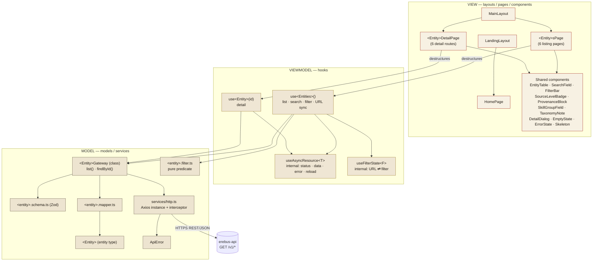

# LLD: erebus-app

**Version:** 1.0
**Date:** 2026-09-10
**Owner:** rattopedro@gmail.com
**Parent documents:** `docs/prd.md` (Phase 1 PRD), `erebus-app/docs/hld-erebus-app.md` (HLD v1.1), `erebus-app/docs/design/design-system.md` (Códice v1)
**Sibling contract:** `erebus-api/docs/lld-erebus-api.md` (§5 HTTP contract, §6 data models)
**Status:** Normative — binding for all code written in `erebus-app`

---

## 0. How to read this document

This LLD is a **normative contract**, not a discussion. It is written to be executed
literally by AI agents (`javascript-developer`, `javascript-qa-engineer`, `tech-lead`)
and by humans writing code in `erebus-app`.

Rules of engagement:

- **MUST / MUST NOT** — non-negotiable. Code violating these is rejected in review.
- **SHOULD** — the default; deviation requires an explicit note in `PLAN.md`.
- **MAY** — free choice.
- Where this document and the HLD disagree, **this document wins for implementation
  detail**; the HLD wins for scope and architectural intent.
- Where this document and `design-system.md` disagree on a **visual** decision, the
  design system wins; on a **code** decision, this document wins.
- Anything not covered here MUST follow the closest existing pattern in the codebase.
  If no pattern exists, stop and escalate to `tech-lead` — **do not invent a new one**.

Language rule: this document is written in English. **All code, identifiers, file
names, comments, JSDoc, commit messages, test descriptions, log messages and
user-facing UI copy MUST be in English.** Domain data values (weapon names, skill
names, `skillGroup` values such as `Armas Brancas*`) stay in their source language
(Portuguese) because they are **data, not code**.

> **Note on `design-system.md`:** that document renders its component examples with
> Portuguese labels (`PERÍCIA QUE GOVERNA`, `N1 · CANÔNICO`). Those examples are
> **visual** specifications — copy them for form, weight, colour and spacing, but
> render the copy in English (`GOVERNING SKILL`, `L1 · CANONICAL`). See §15.

`erebus-app` is a **separate project** from `erebus-api`. It has its own repository,
its own `package.json`, its own tooling. Never assume a command, dependency or
convention from `erebus-api` applies here — the two LLDs are deliberately parallel in
*shape*, not in *content*.

---

## 1. Architecture objective

Move `erebus-app` from the stock Vite + React scaffold (`src/App.tsx` is still the
boilerplate counter) to a **read-only catalogue SPA** that consumes `erebus-api` and
lets a Daemon System player or game master list, search, filter and inspect melee
weapons, ranged weapons, firearms, protections, skills and enhancements — with the
provenance of every record always visible.

The architecture MUST guarantee, in this order of priority:

1. **MVVM isolation.** The View never performs I/O and never knows Axios exists. The
   Model never imports React. The ViewModel is the only place the two meet. Swapping
   the HTTP client MUST NOT touch a single `.tsx` file.
2. **A View depends on an interface, not an implementation.** A page consumes only
   what its hook exposes (§4.2). It MUST NOT know whether the data came from one
   request or six, from cache or from the network, or how the filter is applied.
3. **Provenance integrity.** Every record rendered — in a table row, in a detail
   panel, in a search result — MUST carry its `sourceLevel` and `source`. A Level 2/3
   record MUST NOT be rendered in a way that could be mistaken for Level 1
   (PRD §5 risk, `design-system.md` §1.3).
4. **Rules taxonomy above navigation taxonomy (ADR-001).** `category`
   (melee/ranged/firearm) is navigation. `skillGroup` is the rule. Every weapon
   detail MUST render `skillGroup` as a first-class field, and the ranged listing
   MUST carry the standing note that bows and crossbows are tested under
   `Armas Brancas*`.
5. **Contract-break containment.** An `erebus-api` schema change MUST fail loudly at
   the Model boundary (Zod, §6.4) and MUST be repairable by editing the mapper alone
   — never by touching the View.
6. **Predictability for agents.** Adding a new entity MUST be a mechanical repetition
   of the reference slice in §7 — no design decisions required.

Explicit non-goals in this phase: authentication, write operations, offline support,
client-side persistence of domain data, server-side rendering, internationalisation
machinery (the UI is English-only), pagination, and any rule execution logic (that is
`erebus-engine`, Phase 2).

---

## 2. Stack and dependencies

The dependency set is **closed**. Adding any runtime dependency not listed here
requires an ADR under `docs/decisions/` approved by `tech-lead`. Removing one
requires the same.

> **Version ranges** below are the floor at the time of writing. The scaffold already
> pins React 19, Vite 8, TypeScript 6 and ESLint 10; `tech-lead` confirms each
> resolved version at install time and updates this table **in the same increment**.
> Never widen a range to make an install succeed — investigate the conflict.

### 2.1 Runtime dependencies

| Package | Version range | Layer | Purpose |
| --- | --- | --- | --- |
| `react` | `^19.2.8` | View | UI runtime (already installed) |
| `react-dom` | `^19.2.8` | View | DOM renderer (already installed) |
| `react-router-dom` | `^7.1.0` | View | Routing, nested layouts, URL filter state |
| `axios` | `^1.7.0` | Model | **The only** HTTP client. Instantiated once (§7.1) |
| `zod` | `^3.23.0` | Model | Validates every API payload before it becomes an Entity |
| `styled-components` | `^6.1.0` | View | **The only** way to style a component |
| `react-hot-toast` | `^2.4.1` | View | Global notification surface, wrapped by `src/services/notification.ts` |

### 2.2 Development dependencies

| Package | Purpose |
| --- | --- |
| `typescript` | Compiler (already installed) |
| `vite`, `@vitejs/plugin-react` | Dev server and build (already installed) |
| `sass` | Compiles the **global** stylesheets only (§9.1) |
| `vitest` | Test runner — unit, component and integration |
| `@vitest/coverage-v8` | Coverage reporting and threshold gates |
| `jsdom` | DOM environment for Vitest |
| `@testing-library/react` | Rendering and querying components (QA layer, and `renderHook` for the dev layer) |
| `@testing-library/jest-dom` | DOM matchers (`toBeInTheDocument`, …) |
| `@testing-library/user-event` | Realistic user interaction in component tests |
| `@playwright/test` | E2E suite (QA layer only) |
| `eslint`, `typescript-eslint`, `eslint-plugin-react-hooks`, `eslint-plugin-react-refresh` | Linting (already installed) |
| `eslint-plugin-import` | Import ordering and layer-boundary enforcement (§2.6) |
| `prettier` | Formatting |
| `@types/node`, `@types/react`, `@types/react-dom` | Type definitions (already installed) |

### 2.3 Forbidden dependencies

MUST NOT be added without an ADR:

- **Any server-state library** — `@tanstack/react-query`, `swr`, `apollo`. The
  ViewModel *is* the server-state layer here; adding one of these would create a
  second, competing ViewModel and dissolve the MVVM boundary.
- **Any global state container** — `redux`, `zustand`, `jotai`, `mobx`, `recoil`.
  Phase 1 state is per-hook and local (§4.4). Introducing a store is an architectural
  change, not a convenience.
- **`msw`** — deliberately rejected during the design interview. Integration tests
  mock at the **gateway** boundary (§10.4), not at the network boundary.
- **Any UI kit** — MUI, Chakra, Ant, Bootstrap, Tailwind. The Códice design system is
  implemented directly in styled-components; a kit would fight it on every token.
- **`lodash`** — use native ES2023.
- **`moment` / `dayjs`** — no date logic in this phase.
- **`fetch` wrappers other than the Axios instance** — one client, one interceptor,
  one error shape.
- **`dotenv`** — Vite reads `.env` files natively; configuration is read through a
  single typed module (§12.2).
- **`i18next` and any i18n runtime** — the UI is English-only in Phase 1.

### 2.4 npm scripts (canonical)

```json
{
  "dev": "vite",
  "build": "tsc -b && vite build",
  "preview": "vite preview",
  "test": "vitest run",
  "test:watch": "vitest",
  "test:coverage": "vitest run --coverage",
  "test:e2e": "playwright test",
  "lint": "eslint . --max-warnings=0",
  "format": "prettier --write ."
}
```

`npm run build` MUST NOT be weakened (e.g. dropping `tsc -b`) to get a green build.

The `name` field of `package.json` is still `"app"` from the scaffold. It MUST be
corrected to `"erebus-app"` in the first increment.

### 2.5 Vite configuration (canonical)

```ts
// vite.config.ts
import react from '@vitejs/plugin-react';
import { fileURLToPath, URL } from 'node:url';
import { defineConfig } from 'vite';

export default defineConfig({
  plugins: [react()],
  resolve: {
    alias: { '@': fileURLToPath(new URL('./src', import.meta.url)) },
  },
  css: {
    preprocessorOptions: {
      scss: { additionalData: `@use '@/styles/_tokens' as *;\n` },
    },
  },
});
```

The `@` alias MUST be mirrored in `tsconfig.app.json` (`"paths": { "@/*": ["./src/*"] }`,
`"baseUrl": "."`) and in `vitest.config.ts`. Deep relative imports (`../../../models/…`)
MUST NOT be written; `./sibling.ts` inside the same folder is fine.

### 2.6 TypeScript and ESLint gates

`tsconfig.app.json` MUST add to the existing scaffold options:

```jsonc
{
  "strict": true,
  "noUncheckedIndexedAccess": true,
  "exactOptionalPropertyTypes": true,
  "baseUrl": ".",
  "paths": { "@/*": ["./src/*"] }
}
```

`eslint.config.js` MUST add the **layer-boundary rules**. These are what make the
dependency rule of §4.1 mechanically enforced rather than merely written down:

```js
// eslint.config.js — added to the existing defineConfig array
{
  files: ['src/models/**/*.ts'],
  rules: {
    'no-restricted-imports': ['error', {
      patterns: [
        { group: ['react', 'react-dom', 'react-router-dom', 'styled-components'],
          message: 'The Model layer MUST NOT know React exists (LLD §4.1).' },
        { group: ['@/hooks/*', '@/pages/*', '@/components/*', '@/layouts/*'],
          message: 'The Model layer MUST NOT import upward (LLD §4.1).' },
      ],
    }],
  },
},
{
  files: ['src/pages/**/*.tsx', 'src/components/**/*.tsx', 'src/layouts/**/*.tsx'],
  rules: {
    'no-restricted-imports': ['error', {
      patterns: [
        { group: ['axios', '@/services/http', '@/models/*.gateway'],
          message: 'The View MUST NOT perform I/O — consume a hook (LLD §4.1, §8.1).' },
        { group: ['react-hot-toast'],
          message: 'Use @/services/notification, never the toast library directly (LLD §12.3).' },
      ],
    }],
  },
},
```

`npm run lint` MUST pass with `--max-warnings=0` before any increment is reported as
complete.

---

## 3. Folder tree

Organisation is **flat, by MVVM role**, exactly as the HLD prescribes in its Next
Steps. Every top-level folder under `src/` is one role; there is no nesting by
entity and no `features/` directory.

```
erebus-app/
├─ docs/
│  ├─ hld-erebus-app.md              # high-level design (parent)
│  ├─ lld-erebus-app.md              # THIS DOCUMENT — normative
│  ├─ lld-erebus-app.html            # generated from the .md — never hand-edited
│  ├─ build-lld-html.py              # the generator
│  └─ design/
│     ├─ design-system.md            # Códice v1 — visual contract
│     └─ *.dc.html                   # design canvases
├─ public/
│  ├─ favicon.svg
│  └─ _redirects                     # SPA fallback for Netlify (§13.2)
├─ src/
│  ├─ components/                    # VIEW — reusable presentational components
│  │  ├─ AppShell.tsx
│  │  ├─ SearchField.tsx
│  │  ├─ FilterBar.tsx
│  │  ├─ SourceLevelBadge.tsx
│  │  ├─ ProvenanceBlock.tsx
│  │  ├─ SkillGroupField.tsx
│  │  ├─ TaxonomyNote.tsx
│  │  ├─ EntityTable.tsx
│  │  ├─ DetailDialog.tsx
│  │  ├─ EmptyState.tsx
│  │  ├─ ErrorState.tsx
│  │  ├─ Skeleton.tsx
│  │  └─ ThemeToggle.tsx
│  ├─ hooks/                         # VIEWMODEL — one factory per entity, plus internals
│  │  ├─ use-melee-weapons.ts
│  │  ├─ use-melee-weapon.ts
│  │  ├─ use-ranged-weapons.ts
│  │  ├─ use-ranged-weapon.ts
│  │  ├─ use-firearms.ts
│  │  ├─ use-firearm.ts
│  │  ├─ use-protections.ts
│  │  ├─ use-protection.ts
│  │  ├─ use-skills.ts
│  │  ├─ use-skill.ts
│  │  ├─ use-enhancements.ts
│  │  ├─ use-enhancement.ts
│  │  ├─ use-async-resource.ts       # internal primitive (§7.5)
│  │  ├─ use-filter-state.ts         # internal primitive — URL ⇄ state (§7.6)
│  │  └─ use-theme.ts
│  ├─ layouts/                       # VIEW — route shells
│  │  ├─ LandingLayout.tsx
│  │  └─ MainLayout.tsx
│  ├─ models/                        # MODEL — types, schemas, mappers, gateways, filters
│  │  ├─ provenance.ts               # shared Provenance type + SourceLevel enum
│  │  ├─ provenance.schema.ts        # shared Zod fragment
│  │  ├─ melee-weapon.ts             # Entity type
│  │  ├─ melee-weapon.schema.ts      # Zod schema + inferred DTO type
│  │  ├─ melee-weapon.mapper.ts      # DTO → Entity
│  │  ├─ melee-weapon.filter.ts      # Filter type + pure predicate
│  │  ├─ melee-weapon.gateway.ts     # concrete class + singleton
│  │  ├─ … (same five files per entity) …
│  │  └─ api-error.ts                # ApiError + ApiErrorKind (§7.2)
│  ├─ pages/                         # VIEW — one component per route
│  │  ├─ HomePage.tsx
│  │  ├─ AboutPage.tsx
│  │  ├─ MeleeWeaponsPage.tsx
│  │  ├─ MeleeWeaponDetailPage.tsx
│  │  ├─ RangedWeaponsPage.tsx
│  │  ├─ RangedWeaponDetailPage.tsx
│  │  ├─ FirearmsPage.tsx
│  │  ├─ FirearmDetailPage.tsx
│  │  ├─ ProtectionsPage.tsx
│  │  ├─ ProtectionDetailPage.tsx
│  │  ├─ SkillsPage.tsx
│  │  ├─ SkillDetailPage.tsx
│  │  ├─ EnhancementsPage.tsx
│  │  ├─ EnhancementDetailPage.tsx
│  │  └─ NotFoundPage.tsx
│  ├─ services/                      # cross-cutting infrastructure
│  │  ├─ config.ts                   # typed, validated environment (§12.2)
│  │  ├─ http.ts                     # the single Axios instance + interceptor (§7.1)
│  │  ├─ notification.ts             # toast facade (§12.3)
│  │  └─ logger.ts                   # structured console.error (§12.1)
│  ├─ styles/                        # GLOBAL Sass only — never component styles
│  │  ├─ _tokens.scss                # Códice tokens, light + dark
│  │  ├─ _fonts.scss                 # @font-face / Google Fonts imports
│  │  └─ global.scss                 # reset + base element styles
│  ├─ routes.tsx                     # the single route table (§5.1)
│  ├─ App.tsx                        # providers + RouterProvider
│  ├─ main.tsx                       # createRoot, imports global.scss
│  └─ vite-env.d.ts                  # typed import.meta.env (§12.2)
├─ tests/                            # QA-owned tests only (§10.1)
│  ├─ component/*.spec.tsx
│  ├─ integration/*.int.spec.tsx
│  ├─ e2e/*.e2e.spec.ts
│  └─ helpers/
│     ├─ render-with-providers.tsx
│     └─ fixtures/*.ts
├─ vitest.config.ts
├─ playwright.config.ts
├─ vite.config.ts
├─ eslint.config.js
└─ package.json
```

Dev-owned unit tests live **beside the source file** as `*.spec.ts(x)` and are not
listed above (§10.1).

Naming conventions for files:

| Artefact | Convention | Example |
| --- | --- | --- |
| React component / page / layout | `PascalCase.tsx`, matching the default export | `MeleeWeaponsPage.tsx` |
| Hook | `use-kebab-case.ts`, exporting `useCamelCase` | `use-melee-weapons.ts` → `useMeleeWeapons` |
| Model file | `kebab-case.<role>.ts` | `melee-weapon.gateway.ts` |
| Entity type file | `kebab-case.ts` (no role suffix) | `melee-weapon.ts` |
| Service | `kebab-case.ts` | `notification.ts` |
| Global stylesheet | `_partial.scss` / `global.scss` | `_tokens.scss` |

---

## 4. Architecture

### 4.1 Layers and the dependency rule

Three layers. Dependencies point **downward only**.

```
┌──────────────────────────────────────────────────────────┐
│  VIEW        layouts/ · pages/ · components/  (.tsx)     │
│  Renders. Handles user events. Holds no I/O, no domain   │
│  rule, no Axios, no URL parsing of filters.              │
└───────────────────────────┬──────────────────────────────┘
                            │ consumes the object a hook returns
┌───────────────────────────▼──────────────────────────────┐
│  VIEWMODEL   hooks/  (.ts)                               │
│  React state, effects, lifecycle, URL sync. Orchestrates │
│  gateways. Exposes state + methods. Knows React AND the  │
│  Model — the only layer that knows both.                 │
└───────────────────────────┬──────────────────────────────┘
                            │ calls gateway methods
┌───────────────────────────▼──────────────────────────────┐
│  MODEL       models/ · services/http.ts  (.ts)           │
│  Entities, Zod schemas, mappers, filter predicates,      │
│  gateway classes. Pure TypeScript. MUST NOT import React.│
└──────────────────────────────────────────────────────────┘
```

Hard rules:

- A file under `src/models/` MUST NOT import `react`, `react-dom`,
  `react-router-dom` or `styled-components`. Enforced by ESLint (§2.6).
- A file under `src/pages/`, `src/components/` or `src/layouts/` MUST NOT import
  `axios`, `@/services/http`, or any `*.gateway`. Enforced by ESLint (§2.6).
- A file under `src/hooks/` MAY import from `src/models/` and from React. It MUST NOT
  import from `src/pages/` or `src/components/` — the ViewModel never knows who
  renders it.
- Nothing imports upward. Ever.
- A component MUST NOT be given a raw Axios `Promise` as a prop as a way around this.

### 4.2 The factory pattern in the ViewModel

**Each domain hook is a factory.** It manufactures and returns a ViewModel object —
a bundle of state and methods — and the consuming component uses only that object.
The component does not know, and MUST NOT be able to discover:

- which gateway (or how many) produced the data;
- whether one request was made or six;
- whether the filter is applied in memory or on the server;
- how loading and error states are tracked internally.

Consequences that are **normative**:

1. **A hook is scoped to a domain, not to a page.** `useMeleeWeapons` is not
   "the MeleeWeaponsPage hook". Any number of components MAY call it, and one
   component MAY compose several hooks (e.g. a global search card calling
   `useSkills` and `useMeleeWeapons` together).
2. **The returned object is the contract.** Changing a key of the returned object is
   a breaking change and requires updating every consumer in the same increment.
3. **The View destructures.** Components read `const { items, status } = useSkills();`
   — never `const vm = useSkills(); vm.items`, and never pass the whole ViewModel
   object down as a single prop.
4. **The hook returns data already fit to render.** Sorting, filtering, empty/loading
   discrimination and derived counts happen in the ViewModel. A component MUST NOT
   contain `items.filter(...)` over domain data.
5. **Gateways are concrete classes**, not factory-generated. Each entity has one
   class (§7.4) with a default-argument constructor so tests can inject a fake.
6. **Every hook accepts an optional gateway override** as its last option, defaulting
   to the module singleton. That is the entire dependency-injection story of this
   application — no container, no Context, no provider.

Two hooks per entity, because the detail view is its own route (§5):

| Hook | Purpose | Returned shape |
| --- | --- | --- |
| `use<Entities>()` | Listing: fetch-all, in-memory search/filter, URL sync | §7.6 |
| `use<Entity>(id)` | Detail: fetch one by id | §7.7 |

### 4.3 Object flow across boundaries

Exactly four shapes exist, and each crosses exactly one boundary:

```
erebus-api JSON
      │  Axios response.data — `unknown`, never trusted
      ▼
   DTO           validated by a Zod schema in the gateway.
      │          Mirrors the API response 1:1. Lives only inside models/.
      ▼          A DTO MUST NOT escape the gateway.
   Entity        produced by a mapper. The app's own domain shape.
      │          Camel-case, null-normalised, derived fields resolved.
      ▼          This is what the ViewModel stores and the View renders.
   ViewModel     the object a hook returns: entities + status + methods.
      │
      ▼
   JSX
```

Why a DTO **and** an Entity when both are camelCase: the mapper is the seam. When
`erebus-api` renames a field, exactly one file changes (`*.mapper.ts`), the Zod schema
fails loudly in the meantime, and no `.tsx` file is touched. That containment is
priority 5 of §1 and the mitigation the HLD names for the risk *"Direct coupling
between erebus-app Models and erebus-api response contract"*.

### 4.4 State ownership

State is **local to each hook invocation**. Two components calling
`useMeleeWeapons()` get two independent ViewModels and issue two `GET` requests.

This is a deliberate, recorded trade-off:

- The dataset is a few hundred rows per entity and the API's target is p95 < 200 ms.
- It keeps the ViewModel unit-testable with zero setup (`renderHook`, no provider).
- It keeps §4.2 rule 6 true: injecting a fake gateway is the whole DI story.

MUST NOT be introduced as a "fix" without an ADR: a shared store, a Context cache, a
request-deduplicating gateway, or a `@tanstack/react-query` client. If duplicate
requests are ever observed to matter, the contingency in the HLD applies and
`tech-lead` decides.

The only shared state in the application is the **theme** (§9.3), which is UI
preference, not domain data.

### 4.5 Component diagram



### 4.6 Sequence — listing, search and filter

```mermaid
sequenceDiagram
  autonumber
  actor U as User
  participant P as MeleeWeaponsPage (View)
  participant H as useMeleeWeapons (ViewModel)
  participant G as MeleeWeaponGateway (Model)
  participant X as Axios + interceptor
  participant A as erebus-api

  U->>P: navigates to /melee-weapons?name=espada
  P->>H: useMeleeWeapons()
  H->>H: read filter from URL searchParams
  H->>G: list({ signal })
  G->>X: GET /v1/melee-weapons
  X->>A: HTTPS
  A-->>X: 200 MeleeWeaponResponseDto[]
  X-->>G: response.data (unknown)
  G->>G: schema.array().parse(data)
  G->>G: map DTO → MeleeWeapon[]
  G-->>H: MeleeWeapon[]
  H->>H: status = 'ready'; apply predicate in memory
  H-->>P: { items, total, status, filter, setName, … }
  P-->>U: EntityTable with SourceLevelBadge per row

  U->>P: types "arco" in SearchField
  P->>H: setName('arco')
  H->>H: write ?name=arco to the URL (replace)
  H->>H: re-run the pure predicate — NO request
  H-->>P: { items: filtered, total: 3 }
  P-->>U: re-render (< 50 ms target)
```

### 4.7 Sequence — detail and error

```mermaid
sequenceDiagram
  autonumber
  actor U as User
  participant P as MeleeWeaponDetailPage (View)
  participant H as useMeleeWeapon (ViewModel)
  participant G as MeleeWeaponGateway (Model)
  participant X as Axios + interceptor
  participant N as notification service
  participant A as erebus-api

  U->>P: clicks a row → navigate /melee-weapons/42
  P->>H: useMeleeWeapon(42)
  H->>G: findById(42, { signal })
  G->>X: GET /v1/melee-weapons/42
  X->>A: HTTPS
  A-->>X: 404 application/problem+json
  X->>X: interceptor → ApiError{ kind:'not-found', problem }
  X-->>G: reject(ApiError)
  G-->>H: reject(ApiError)
  H->>H: status = 'error'; error = ApiError
  H->>N: notify.error('This weapon no longer exists.')
  H-->>P: { item: null, status:'error', error }
  P-->>U: ErrorState inside DetailDialog + toast
  Note over P,U: No automatic retry (HLD). The user retries via the "Try again" action, which calls reload().
```

---

## 5. Routing and URL state

### 5.1 Route table

Route paths mirror the `erebus-api` resource names, in English. The detail view is a
**nested route** of its listing, so a detail dialog is deep-linkable and the browser
back button closes it.

| Path | Layout | Element | Notes |
| --- | --- | --- | --- |
| `/` | `LandingLayout` | `HomePage` | Institutional landing |
| `/about` | `MainLayout` | `AboutPage` | Institutional |
| `/melee-weapons` | `MainLayout` | `MeleeWeaponsPage` | |
| `/melee-weapons/:id` | `MainLayout` | `MeleeWeaponsPage` → `MeleeWeaponDetailPage` | Nested; renders in the page's `<Outlet/>` inside `DetailDialog` |
| `/ranged-weapons` | `MainLayout` | `RangedWeaponsPage` | MUST render `TaxonomyNote` (ADR-001) |
| `/ranged-weapons/:id` | `MainLayout` | → `RangedWeaponDetailPage` | |
| `/firearms` | `MainLayout` | `FirearmsPage` | |
| `/firearms/:id` | `MainLayout` | → `FirearmDetailPage` | |
| `/protections` | `MainLayout` | `ProtectionsPage` | |
| `/protections/:id` | `MainLayout` | → `ProtectionDetailPage` | |
| `/skills` | `MainLayout` | `SkillsPage` | |
| `/skills/:id` | `MainLayout` | → `SkillDetailPage` | Renders `subgroups[]` |
| `/enhancements` | `MainLayout` | `EnhancementsPage` | |
| `/enhancements/:id` | `MainLayout` | → `EnhancementDetailPage` | Renders `levels[]` |
| `*` | `MainLayout` | `NotFoundPage` | |

All routes are declared in **one file**, `src/routes.tsx`. A route MUST NOT be
declared anywhere else.

Route paths MUST be referenced through the exported `ROUTES` constant, never as
string literals scattered through components:

```ts
// src/routes.tsx
export const ROUTES = {
  home: '/',
  about: '/about',
  meleeWeapons: '/melee-weapons',
  meleeWeapon: (id: number | string) => `/melee-weapons/${id}`,
  rangedWeapons: '/ranged-weapons',
  rangedWeapon: (id: number | string) => `/ranged-weapons/${id}`,
  firearms: '/firearms',
  firearm: (id: number | string) => `/firearms/${id}`,
  protections: '/protections',
  protection: (id: number | string) => `/protections/${id}`,
  skills: '/skills',
  skill: (id: number | string) => `/skills/${id}`,
  enhancements: '/enhancements',
  enhancement: (id: number | string) => `/enhancements/${id}`,
} as const;
```

### 5.2 Filter state in the URL

Search and filter live in `searchParams`, owned by the ViewModel via the internal
`useFilterState` primitive (§7.6).

Rules:

- Parameter names match the **Entity field names** (`name`, `sourceLevel`,
  `baseAttribute`, `ammunition`, `minCost`, `maxCost`, `campaignType`).
- Writing a filter MUST use `{ replace: true }` — typing in a search field MUST NOT
  push one history entry per keystroke.
- An empty value MUST remove the parameter, never write `?name=`.
- A malformed parameter (`?sourceLevel=9`) MUST be **ignored and dropped**, falling
  back to the default. It MUST NOT throw, and it MUST NOT be sent to the API.
- Parsing/serialising a filter is done by a pure function per entity so it is
  unit-testable without a router.

A hook MAY be constructed with `{ urlSync: false }` to keep its filter in local state
instead — required when the hook is consumed by a component that is not the page
owning the URL (e.g. a search card in `MainLayout`).

### 5.3 Navigation and the detail dialog

Clicking a row calls `navigate(ROUTES.meleeWeapon(id))`. The listing page keeps
rendering; the nested route renders inside `<Outlet />`, wrapped by `DetailDialog`.
Closing the dialog calls `navigate(ROUTES.meleeWeapons + location.search)` so the
active filter survives the round trip.

The dialog MUST trap focus, close on `Escape`, restore focus to the triggering row,
and carry `role="dialog"` with `aria-modal="true"` and an `aria-labelledby` pointing
at the entity name.

---

## 6. Data models

### 6.1 Naming conventions

- Types are `PascalCase`; properties are `camelCase`.
- The Entity type carries the bare entity name: `MeleeWeapon`, `Skill`.
- The DTO type is the entity name plus `Dto`: `MeleeWeaponDto`. It is **inferred**
  from the Zod schema (`z.infer`), never hand-written twice.
- The filter type is the entity name plus `Filter`: `MeleeWeaponFilter`.
- The ViewModel type is the entity name plus `ListViewModel` / `DetailViewModel`.
- Enums are `as const` objects plus a derived union. TypeScript `enum` MUST NOT be
  used (it emits runtime code and narrows badly against API strings).

### 6.2 Provenance — shared across all six entities

```ts
// src/models/provenance.ts
export const SourceLevel = {
  Canonical: 1,
  Official: 2,
  Community: 3,
} as const;
export type SourceLevel = (typeof SourceLevel)[keyof typeof SourceLevel];

/** Where a record came from. Present on EVERY entity — never optional. */
export interface Provenance {
  sourceLevel: SourceLevel;
  source: string;
  editionOrVersion: string | null;
}
```

```ts
// src/models/provenance.schema.ts
import { z } from 'zod';

export const provenanceSchema = z.object({
  sourceLevel: z.union([z.literal(1), z.literal(2), z.literal(3)]),
  source: z.string().min(1),
  editionOrVersion: z.string().nullable().default(null),
});
```

Level 4 (community discussion) does not exist in the database and MUST NOT be
representable in the app. A payload carrying `sourceLevel: 4` is a **contract
violation** and MUST fail Zod parsing.

Every entity type extends `Provenance`. A rendered record without a visible
`SourceLevelBadge` is a Definition-of-Done failure (§14).

### 6.3 Entity types

The shapes below mirror the DTOs of `erebus-api` LLD §5–6. Where that document does
not spell a DTO out field by field, the frontend model MUST be confirmed against the
live OpenAPI spec at `/v1/docs` **before** the entity is implemented, and any
divergence resolved in the mapper — never by loosening the Zod schema.

```ts
// src/models/melee-weapon.ts
import type { Provenance } from './provenance';

export interface MeleeWeapon extends Provenance {
  id: number;
  name: string;
  /** Canonical Daemon skill that governs the weapon — ADR-001. Never optional. */
  skillGroup: string;
  damage: string;
  initiative: number | null;
  weightKg: number | null;
  priceUsd: number | null;
  notes: string | null;
}
```

```ts
// src/models/ranged-weapon.ts
export interface RangedWeapon extends Provenance {
  id: number;
  name: string;
  skillGroup: string;
  /** True when this record also appears in the melee listing — same id, not a copy. */
  isThrown: boolean;
  damage: string;
  initiative: number | null;
  normalRangeM: number | null;
  maxRangeM: number | null;
  weightKg: number | null;
  priceUsd: number | null;
  notes: string | null;
}
```

```ts
// src/models/firearm.ts
export interface Firearm extends Provenance {
  id: number;
  name: string;
  skillGroup: string;
  damage: string;
  ammunition: string | null;
  magazineSize: number | null;
  magazineType: string | null;
  rateOfFire: number | null;
  normalRangeM: number | null;
  maxRangeM: number | null;
  weightKg: number | null;
  priceUsd: number | null;
  notes: string | null;
}
```

```ts
// src/models/protection.ts
export const ProtectionKind = {
  Armor: 'armor',
  Vest: 'vest',
  Specific: 'specific',
  Cover: 'cover',
} as const;
export type ProtectionKind = (typeof ProtectionKind)[keyof typeof ProtectionKind];

export interface Protection extends Provenance {
  id: number;
  name: string;
  kind: ProtectionKind;
  armorPoints: number | null;
  kineticArmorPoints: number | null;
  ballisticArmorPoints: number | null;
  additionalArmorPoints: number | null;
  protectsAgainst: string | null;
  dexterityPenalty: number;
  agilityPenalty: number;
}
```

```ts
// src/models/skill.ts
export const BaseAttribute = {
  Agility: 'AGI', Charisma: 'CAR', Constitution: 'CON', Dexterity: 'DEX',
  Strength: 'FR', Intelligence: 'INT', Perception: 'PER', Willpower: 'WILL',
} as const;
export type BaseAttribute = (typeof BaseAttribute)[keyof typeof BaseAttribute];

export interface Skill extends Provenance {
  id: number;
  name: string;
  parentSkillId: number | null;
  /** A group with subgroups is NOT purchasable — the View MUST surface this. */
  hasSubgroups: boolean;
  baseAttribute: BaseAttribute | null;
  /** Resolved by the API as subgroup.baseAttribute ?? parent.baseAttribute. */
  effectiveBaseAttribute: BaseAttribute | null;
  initialValueType: string | null;
  prerequisite: string | null;
  damage: string | null;
  notes: string | null;
}

/** Returned only by GET /v1/skills/:id. */
export interface SkillDetail extends Skill {
  subgroups: Skill[];
}
```

Skill names repeat across groups — uniqueness is `(parentSkillId, name)`, never
`name` alone. A React `key` MUST therefore be `skill.id`, never `skill.name`.

```ts
// src/models/enhancement.ts
export interface EnhancementLevel {
  level: number;
  cost: number;
  effect: string;
}

export interface Enhancement extends Provenance {
  id: number;
  name: string;
  description: string | null;
  generalEffect: string | null;
  restriction: string | null;
  prerequisiteFor: string | null;
  notes: string | null;
}

/** Returned only by GET /v1/enhancements/:id. */
export interface EnhancementDetail extends Enhancement {
  levels: EnhancementLevel[];
}
```

### 6.4 Schemas — the contract tripwire

Every gateway method MUST parse its payload through a Zod schema before mapping.
This is the mechanism that turns the HLD's *"API schema change breaks Gateways
without warning"* risk into a loud, typed, single-file failure.

```ts
// src/models/melee-weapon.schema.ts
import { z } from 'zod';
import { provenanceSchema } from './provenance.schema';

export const meleeWeaponDtoSchema = provenanceSchema.extend({
  id: z.number().int().positive(),
  name: z.string().min(1),
  skillGroup: z.string().min(1),
  damage: z.string().min(1),
  initiative: z.number().int().nullable().default(null),
  weightKg: z.number().nullable().default(null),
  priceUsd: z.number().nullable().default(null),
  notes: z.string().nullable().default(null),
});

export const meleeWeaponListDtoSchema = z.array(meleeWeaponDtoSchema);

export type MeleeWeaponDto = z.infer<typeof meleeWeaponDtoSchema>;
```

Rules:

- Schemas MUST be **strict about what the app depends on** and tolerant about the
  rest: unknown extra keys are stripped by default (Zod's default behaviour) so the
  API MAY add fields without breaking the app.
- `.optional()` MUST NOT be used where the API contract says a field is always
  present. Silently tolerating a missing `skillGroup` or `sourceLevel` defeats the
  purpose of the schema.
- A parse failure MUST surface as `ApiError{ kind: 'contract' }` (§7.2) — it is a
  bug to report, not an empty list to render.

### 6.5 Filters — pure predicates

Filtering is in-memory (HLD). The predicate is a **pure function over the Entity**,
lives in the Model layer, and is unit-tested without React.

```ts
// src/models/melee-weapon.filter.ts
import type { MeleeWeapon } from './melee-weapon';
import type { SourceLevel } from './provenance';

export interface MeleeWeaponFilter {
  name: string;
  sourceLevel: SourceLevel | null;
  skillGroup: string | null;
}

export const emptyMeleeWeaponFilter: MeleeWeaponFilter = {
  name: '',
  sourceLevel: null,
  skillGroup: null,
};

/** Accent- and case-insensitive contains, so "pericia" matches "Perícia". */
export const normalise = (value: string): string =>
  value.normalize('NFD').replace(/\p{Diacritic}/gu, '').toLowerCase().trim();

export function matchesMeleeWeaponFilter(
  weapon: MeleeWeapon,
  filter: MeleeWeaponFilter,
): boolean {
  if (filter.name && !normalise(weapon.name).includes(normalise(filter.name))) {
    return false;
  }
  if (filter.sourceLevel !== null && weapon.sourceLevel !== filter.sourceLevel) {
    return false;
  }
  if (filter.skillGroup !== null && weapon.skillGroup !== filter.skillGroup) {
    return false;
  }
  return true;
}
```

`normalise` lives in one place and is shared by every entity filter — the catalogue
data is Portuguese and accent-sensitive search would be a usability bug.

---

## 7. Reference implementation — the melee weapon vertical slice

**This section is the template.** Adding another entity is copying these eight files
and changing the names. If a new entity cannot be expressed this way, stop and
escalate to `tech-lead` — do not improvise a second pattern.

### 7.1 The HTTP client

```ts
// src/services/http.ts
import axios from 'axios';
import { config } from './config';
import { toApiError } from '@/models/api-error';

/** The single Axios instance of the application. There MUST NOT be a second. */
export const http = axios.create({
  baseURL: config.apiBaseUrl,
  timeout: config.requestTimeoutMs,
  headers: { Accept: 'application/json' },
});

http.interceptors.response.use(
  (response) => response,
  (error: unknown) => Promise.reject(toApiError(error)),
);
```

Nothing outside `src/models/` and `src/services/` may import this module.

### 7.2 The error shape

```ts
// src/models/api-error.ts
import axios from 'axios';
import { ZodError } from 'zod';

export const ApiErrorKind = {
  /** No response at all: offline, DNS, CORS, API down. */
  Network: 'network',
  /** The request exceeded config.requestTimeoutMs. */
  Timeout: 'timeout',
  /** 404 — the resource does not exist. */
  NotFound: 'not-found',
  /** 400 — the API rejected our parameters. A bug in this app. */
  Validation: 'validation',
  /** The payload did not match the schema. The API contract changed. */
  Contract: 'contract',
  /** 5xx or anything else unexpected. */
  Server: 'server',
} as const;
export type ApiErrorKind = (typeof ApiErrorKind)[keyof typeof ApiErrorKind];

/** RFC 7807 body returned by erebus-api. */
export interface ProblemDetails {
  type: string;
  title: string;
  status: number;
  detail: string;
  instance: string;
  errors?: { field: string; message: string }[];
}

export class ApiError extends Error {
  readonly kind: ApiErrorKind;
  readonly status: number | null;
  readonly problem: ProblemDetails | null;

  constructor(kind: ApiErrorKind, message: string, status: number | null = null,
              problem: ProblemDetails | null = null) {
    super(message);
    this.name = 'ApiError';
    this.kind = kind;
    this.status = status;
    this.problem = problem;
  }
}

const isProblemDetails = (data: unknown): data is ProblemDetails =>
  typeof data === 'object' && data !== null && 'title' in data && 'status' in data;

/** Normalises every failure the Model layer can produce into one shape. */
export function toApiError(error: unknown): ApiError {
  if (error instanceof ApiError) return error;

  if (error instanceof ZodError) {
    return new ApiError(
      ApiErrorKind.Contract,
      `The API response did not match the expected contract: ${error.message}`,
    );
  }

  if (axios.isAxiosError(error)) {
    if (error.code === 'ECONNABORTED') {
      return new ApiError(ApiErrorKind.Timeout, 'The request timed out.');
    }
    if (!error.response) {
      return new ApiError(ApiErrorKind.Network, 'The service could not be reached.');
    }
    const { status, data } = error.response;
    const problem = isProblemDetails(data) ? data : null;
    const kind =
      status === 404 ? ApiErrorKind.NotFound
      : status === 400 ? ApiErrorKind.Validation
      : ApiErrorKind.Server;
    return new ApiError(kind, problem?.detail ?? error.message, status, problem);
  }

  return new ApiError(ApiErrorKind.Server, 'An unexpected error occurred.');
}
```

`AxiosError` MUST NOT appear outside this file. No `catch` block anywhere else may
inspect `error.response`.

**Copy shown to the user** is chosen by the View from `error.kind` — never by
rendering `error.message`, and never by rendering `problem.detail` (which is written
for developers and may contain identifiers).

### 7.3 The mapper

```ts
// src/models/melee-weapon.mapper.ts
import type { MeleeWeapon } from './melee-weapon';
import type { MeleeWeaponDto } from './melee-weapon.schema';

/** DTO → Entity. The ONLY place the API vocabulary meets the app vocabulary. */
export function toMeleeWeapon(dto: MeleeWeaponDto): MeleeWeapon {
  return {
    id: dto.id,
    name: dto.name,
    skillGroup: dto.skillGroup,
    damage: dto.damage,
    initiative: dto.initiative,
    weightKg: dto.weightKg,
    priceUsd: dto.priceUsd,
    notes: dto.notes,
    sourceLevel: dto.sourceLevel,
    source: dto.source,
    editionOrVersion: dto.editionOrVersion,
  };
}
```

Yes, it is currently a near-identity function. That is the point: it is the seam that
absorbs the next API rename without a single `.tsx` file changing. Writing
`return dto as MeleeWeapon` instead is an anti-pattern (§8.4).

### 7.4 The gateway — a concrete class

```ts
// src/models/melee-weapon.gateway.ts
import type { AxiosInstance } from 'axios';
import { http } from '@/services/http';
import { toApiError } from './api-error';
import { toMeleeWeapon } from './melee-weapon.mapper';
import { meleeWeaponDtoSchema, meleeWeaponListDtoSchema } from './melee-weapon.schema';
import type { MeleeWeapon } from './melee-weapon';

/**
 * Encapsulates every HTTP call to the melee weapon endpoints of erebus-api.
 * Returns Entities. Never leaks a DTO, an AxiosError or an AxiosResponse.
 */
export class MeleeWeaponGateway {
  /** The default argument is the production wiring; tests pass a fake. */
  constructor(private readonly client: AxiosInstance = http) {}

  async list(signal?: AbortSignal): Promise<MeleeWeapon[]> {
    try {
      const { data } = await this.client.get<unknown>('/melee-weapons', { signal });
      return meleeWeaponListDtoSchema.parse(data).map(toMeleeWeapon);
    } catch (error) {
      throw toApiError(error);
    }
  }

  async findById(id: number, signal?: AbortSignal): Promise<MeleeWeapon> {
    try {
      const { data } = await this.client.get<unknown>(`/melee-weapons/${id}`, { signal });
      return toMeleeWeapon(meleeWeaponDtoSchema.parse(data));
    } catch (error) {
      throw toApiError(error);
    }
  }
}

/** Production singleton — what every hook imports by default. */
export const meleeWeaponGateway = new MeleeWeaponGateway();
```

Rules for every gateway:

- One class per entity, `<Entity>Gateway`, exporting a module singleton.
- Methods are named after the intent (`list`, `findById`), never after HTTP verbs.
- `list()` in Phase 1 takes **no filter** — the whole collection is fetched once and
  filtered in memory (HLD). A filter parameter MAY be added later for server-side
  filtering; adding it now would be dead code with two competing filter paths.
- Every method accepts an `AbortSignal` and forwards it, so the ViewModel can cancel
  on unmount (§7.5).
- Every method wraps its body in `try/catch { throw toApiError(error) }`, so a Zod
  failure becomes an `ApiError` too.
- The response type parameter is `<unknown>`, never `<MeleeWeaponDto[]>` — typing it
  would be a lie the schema exists to prevent (§8.5).

### 7.5 The async primitive

```ts
// src/hooks/use-async-resource.ts
import { useCallback, useEffect, useRef, useState } from 'react';
import { ApiError, toApiError } from '@/models/api-error';

export type ResourceStatus = 'idle' | 'loading' | 'ready' | 'error';

export interface AsyncResource<T> {
  data: T | null;
  status: ResourceStatus;
  error: ApiError | null;
  reload: () => void;
}

/**
 * Runs an async fetcher on mount and on demand, tracking status and error, and
 * aborting the in-flight request on unmount or re-run. Internal to the ViewModel
 * layer — a View MUST NOT import this.
 */
export function useAsyncResource<T>(
  fetcher: (signal: AbortSignal) => Promise<T>,
  deps: readonly unknown[],
): AsyncResource<T> {
  const [data, setData] = useState<T | null>(null);
  const [status, setStatus] = useState<ResourceStatus>('idle');
  const [error, setError] = useState<ApiError | null>(null);
  const [nonce, setNonce] = useState(0);
  const fetcherRef = useRef(fetcher);
  fetcherRef.current = fetcher;

  useEffect(() => {
    const controller = new AbortController();
    let active = true;

    setStatus('loading');
    setError(null);

    fetcherRef
      .current(controller.signal)
      .then((result) => {
        if (!active) return;
        setData(result);
        setStatus('ready');
      })
      .catch((cause: unknown) => {
        if (!active || controller.signal.aborted) return;
        setError(toApiError(cause));
        setStatus('error');
      });

    return () => {
      active = false;
      controller.abort();
    };
    // eslint-disable-next-line react-hooks/exhaustive-deps
  }, [...deps, nonce]);

  const reload = useCallback(() => setNonce((n) => n + 1), []);

  return { data, status, error, reload };
}
```

### 7.6 The listing ViewModel — the hook as factory

```ts
// src/hooks/use-melee-weapons.ts
import { useCallback, useMemo } from 'react';
import { MeleeWeaponGateway, meleeWeaponGateway } from '@/models/melee-weapon.gateway';
import {
  emptyMeleeWeaponFilter, matchesMeleeWeaponFilter,
} from '@/models/melee-weapon.filter';
import type { MeleeWeaponFilter } from '@/models/melee-weapon.filter';
import type { MeleeWeapon } from '@/models/melee-weapon';
import type { SourceLevel } from '@/models/provenance';
import { useAsyncResource } from './use-async-resource';
import { useFilterState } from './use-filter-state';
import { parseMeleeWeaponFilter, serialiseMeleeWeaponFilter } from '@/models/melee-weapon.filter';
import type { ApiError } from '@/models/api-error';
import type { ResourceStatus } from './use-async-resource';

export interface MeleeWeaponsOptions {
  /** Keep the filter in the URL. Set false when the consumer does not own the URL. */
  urlSync?: boolean;
  /** Test seam — production callers never pass this. */
  gateway?: MeleeWeaponGateway;
}

/** Everything a View may know about melee weapons. Nothing else is exposed. */
export interface MeleeWeaponsViewModel {
  items: MeleeWeapon[];
  total: number;
  matchCount: number;
  isEmpty: boolean;
  isFiltered: boolean;
  status: ResourceStatus;
  error: ApiError | null;
  filter: MeleeWeaponFilter;
  skillGroupOptions: string[];
  setName: (name: string) => void;
  setSourceLevel: (level: SourceLevel | null) => void;
  setSkillGroup: (skillGroup: string | null) => void;
  clearFilters: () => void;
  reload: () => void;
}

/**
 * ViewModel factory for the melee weapon catalogue.
 *
 * Fetches the full collection once, then applies search and filter in memory.
 * Any component MAY call this — it is scoped to the domain, not to a page.
 */
export function useMeleeWeapons(options: MeleeWeaponsOptions = {}): MeleeWeaponsViewModel {
  const { urlSync = true, gateway = meleeWeaponGateway } = options;

  const { filter, patch, clear } = useFilterState({
    empty: emptyMeleeWeaponFilter,
    parse: parseMeleeWeaponFilter,
    serialise: serialiseMeleeWeaponFilter,
    urlSync,
  });

  const fetcher = useCallback(
    (signal: AbortSignal) => gateway.list(signal),
    [gateway],
  );
  const { data, status, error, reload } = useAsyncResource(fetcher, [fetcher]);

  const all = useMemo(() => data ?? [], [data]);

  const items = useMemo(
    () => all
      .filter((weapon) => matchesMeleeWeaponFilter(weapon, filter))
      .sort((a, b) => a.name.localeCompare(b.name, 'pt-BR')),
    [all, filter],
  );

  const skillGroupOptions = useMemo(
    () => [...new Set(all.map((weapon) => weapon.skillGroup))].sort(),
    [all],
  );

  const isFiltered =
    filter.name !== '' || filter.sourceLevel !== null || filter.skillGroup !== null;

  return {
    items,
    total: all.length,
    matchCount: items.length,
    isEmpty: status === 'ready' && items.length === 0,
    isFiltered,
    status,
    error,
    filter,
    skillGroupOptions,
    setName: useCallback((name: string) => patch({ name }), [patch]),
    setSourceLevel: useCallback((sourceLevel: SourceLevel | null) => patch({ sourceLevel }), [patch]),
    setSkillGroup: useCallback((skillGroup: string | null) => patch({ skillGroup }), [patch]),
    clearFilters: clear,
    reload,
  };
}
```

Note what the ViewModel does **for** the View, so the View never has to: sorting,
filtering, deriving `skillGroupOptions` for the FilterBar, distinguishing "no data"
from "no matches" (`isEmpty` + `isFiltered`), and exposing one narrow setter per
control rather than a raw `setFilter`.

### 7.7 The detail ViewModel

```ts
// src/hooks/use-melee-weapon.ts
import { useCallback } from 'react';
import { MeleeWeaponGateway, meleeWeaponGateway } from '@/models/melee-weapon.gateway';
import type { MeleeWeapon } from '@/models/melee-weapon';
import type { ApiError } from '@/models/api-error';
import { useAsyncResource } from './use-async-resource';
import type { ResourceStatus } from './use-async-resource';

export interface MeleeWeaponViewModel {
  item: MeleeWeapon | null;
  status: ResourceStatus;
  error: ApiError | null;
  notFound: boolean;
  reload: () => void;
}

export function useMeleeWeapon(
  id: number,
  options: { gateway?: MeleeWeaponGateway } = {},
): MeleeWeaponViewModel {
  const { gateway = meleeWeaponGateway } = options;

  const fetcher = useCallback(
    (signal: AbortSignal) => gateway.findById(id, signal),
    [gateway, id],
  );
  const { data, status, error, reload } = useAsyncResource(fetcher, [fetcher]);

  return {
    item: data,
    status,
    error,
    notFound: error?.kind === 'not-found',
    reload,
  };
}
```

### 7.8 The View — listing page

```tsx
// src/pages/MeleeWeaponsPage.tsx
import { Outlet, useNavigate } from 'react-router-dom';
import styled from 'styled-components';
import { EntityTable } from '@/components/EntityTable';
import { ErrorState } from '@/components/ErrorState';
import { EmptyState } from '@/components/EmptyState';
import { FilterBar } from '@/components/FilterBar';
import { SearchField } from '@/components/SearchField';
import { SourceLevelBadge } from '@/components/SourceLevelBadge';
import { Skeleton } from '@/components/Skeleton';
import { useMeleeWeapons } from '@/hooks/use-melee-weapons';
import { ROUTES } from '@/routes';

const Header = styled.header`
  display: flex;
  align-items: baseline;
  justify-content: space-between;
  gap: 22px;
  margin-bottom: 16px;
`;

const Title = styled.h1`
  font-family: 'EB Garamond', Georgia, serif;
  font-size: 34px;
  font-weight: 500;
  color: var(--ink);
`;

const Count = styled.span`
  font-family: 'IBM Plex Mono', ui-monospace, monospace;
  font-size: 13px;
  color: var(--ink-muted);
`;

export default function MeleeWeaponsPage() {
  const navigate = useNavigate();
  const {
    items, total, matchCount, isEmpty, isFiltered,
    status, error, filter, skillGroupOptions,
    setName, setSourceLevel, setSkillGroup, clearFilters, reload,
  } = useMeleeWeapons();

  return (
    <section aria-labelledby="melee-weapons-title">
      <Header>
        <Title id="melee-weapons-title">Melee weapons</Title>
        <Count>{matchCount} of {total}</Count>
      </Header>

      <SearchField
        label="Search by name"
        value={filter.name}
        onChange={setName}
      />
      <FilterBar
        sourceLevel={filter.sourceLevel}
        onSourceLevelChange={setSourceLevel}
        skillGroup={filter.skillGroup}
        skillGroupOptions={skillGroupOptions}
        onSkillGroupChange={setSkillGroup}
        onClear={clearFilters}
        isFiltered={isFiltered}
      />

      {status === 'loading' && <Skeleton rows={8} />}

      {status === 'error' && error && (
        <ErrorState kind={error.kind} onRetry={reload} />
      )}

      {status === 'ready' && isEmpty && (
        <EmptyState
          title={isFiltered ? 'No weapon matches this search' : 'No weapons available'}
          action={isFiltered ? { label: 'Clear filters', onClick: clearFilters } : undefined}
        />
      )}

      {status === 'ready' && !isEmpty && (
        <EntityTable
          caption="Melee weapons"
          columns={[
            { key: 'name', header: 'Weapon' },
            { key: 'skillGroup', header: 'Governing skill' },
            { key: 'damage', header: 'Damage', numeric: true },
            { key: 'initiative', header: 'IN', numeric: true },
            { key: 'source', header: 'Source' },
          ]}
          rows={items}
          rowKey={(weapon) => weapon.id}
          onRowClick={(weapon) => navigate(ROUTES.meleeWeapon(weapon.id))}
          renderCell={(weapon, key) =>
            key === 'source'
              ? <SourceLevelBadge level={weapon.sourceLevel} compact />
              : weapon[key]}
        />
      )}

      <Outlet />
    </section>
  );
}
```

What this page does **not** contain, and MUST NOT: an `import` of Axios or a gateway,
a `useEffect` that fetches, a `useState` holding domain data, a `.filter()` over
weapons, a `try/catch`, a reference to `import.meta.env`, or a raw hex colour.

### 7.9 The View — detail route

```tsx
// src/pages/MeleeWeaponDetailPage.tsx
import { useNavigate, useParams, useLocation } from 'react-router-dom';
import { DetailDialog } from '@/components/DetailDialog';
import { ErrorState } from '@/components/ErrorState';
import { ProvenanceBlock } from '@/components/ProvenanceBlock';
import { SkillGroupField } from '@/components/SkillGroupField';
import { Skeleton } from '@/components/Skeleton';
import { useMeleeWeapon } from '@/hooks/use-melee-weapon';
import { ROUTES } from '@/routes';

export default function MeleeWeaponDetailPage() {
  const { id } = useParams();
  const navigate = useNavigate();
  const { search } = useLocation();
  const { item, status, error, reload } = useMeleeWeapon(Number(id));

  const close = () => navigate({ pathname: ROUTES.meleeWeapons, search });

  return (
    <DetailDialog title={item?.name ?? 'Melee weapon'} onClose={close}>
      {status === 'loading' && <Skeleton rows={5} />}
      {status === 'error' && error && <ErrorState kind={error.kind} onRetry={reload} />}
      {status === 'ready' && item && (
        <>
          {/* ADR-001: the governing skill is a first-class field, never a footnote. */}
          <SkillGroupField value={item.skillGroup} />
          <dl>
            <dt>Damage</dt><dd>{item.damage}</dd>
            <dt>Initiative</dt><dd>{item.initiative ?? '—'}</dd>
            <dt>Weight</dt><dd>{item.weightKg !== null ? `${item.weightKg} kg` : '—'}</dd>
            <dt>Price</dt><dd>{item.priceUsd !== null ? `$${item.priceUsd}` : '—'}</dd>
            {item.notes && <><dt>Notes</dt><dd>{item.notes}</dd></>}
          </dl>
          <ProvenanceBlock provenance={item} />
        </>
      )}
    </DetailDialog>
  );
}
```

### 7.10 Application assembly

```tsx
// src/App.tsx
import { RouterProvider } from 'react-router-dom';
import { Toaster } from 'react-hot-toast';
import { router } from './routes';
import { ThemeProvider } from './hooks/use-theme';

export default function App() {
  return (
    <ThemeProvider>
      <RouterProvider router={router} />
      <Toaster position="bottom-right" />
    </ThemeProvider>
  );
}
```

```tsx
// src/main.tsx
import { StrictMode } from 'react';
import { createRoot } from 'react-dom/client';
import App from './App';
import './styles/global.scss';

createRoot(document.getElementById('root')!).render(
  <StrictMode>
    <App />
  </StrictMode>,
);
```

`main.tsx` is the **only** file that imports a `.scss` file (§9.1).

### 7.11 Checklist — adding a new entity

Mechanical. No design decisions.

1. `src/models/<entity>.ts` — Entity type extending `Provenance`.
2. `src/models/<entity>.schema.ts` — Zod schema (+ list schema), DTO type inferred.
3. `src/models/<entity>.mapper.ts` — `to<Entity>(dto)`.
4. `src/models/<entity>.filter.ts` — Filter type, empty value, predicate, URL
   parse/serialise pair.
5. `src/models/<entity>.gateway.ts` — class + singleton.
6. `src/hooks/use-<entities>.ts` — listing ViewModel factory.
7. `src/hooks/use-<entity>.ts` — detail ViewModel factory.
8. `src/pages/<Entity>sPage.tsx` and `src/pages/<Entity>DetailPage.tsx`.
9. Register both routes in `src/routes.tsx` and add the entry to `ROUTES`.
10. Add the navigation item to `MainLayout`.
11. Dev: unit tests for mapper, filter predicate, gateway and both hooks (§10.2).
12. QA: component + integration tests, and E2E per use case (§10.3–10.5).

---

## 8. Anti-patterns

Each item shows the rejected form and the required form. Code matching a ❌ block is
rejected in review.

### 8.1 I/O in the View

❌ **Rejected**

```tsx
function SkillsPage() {
  const [skills, setSkills] = useState<Skill[]>([]);
  useEffect(() => {
    axios.get('/skills').then((r) => setSkills(r.data));
  }, []);
  return <SkillTable rows={skills} />;
}
```

✅ **Required**

```tsx
function SkillsPage() {
  const { items, status, error, reload } = useSkills();
  return <SkillTable rows={items} status={status} error={error} onRetry={reload} />;
}
```

The View does not fetch, does not hold domain data in `useState`, does not know the
URL of an endpoint.

### 8.2 Domain logic in the View

❌ **Rejected**

```tsx
const visible = items
  .filter((s) => s.name.toLowerCase().includes(term.toLowerCase()))
  .filter((s) => level === null || s.sourceLevel === level);
```

✅ **Required** — the predicate lives in `models/skill.filter.ts` and the ViewModel
applies it. The View receives `items` already filtered.

### 8.3 The Model importing React

❌ **Rejected**

```ts
// models/skill.gateway.ts
import { useState } from 'react';           // the Model layer knows React exists
export function useSkillGateway() { … }
```

✅ **Required** — the gateway is a plain class. Anything with a lifecycle belongs in
`src/hooks/`. Enforced by ESLint (§2.6).

### 8.4 Trusting the payload

❌ **Rejected**

```ts
const { data } = await this.client.get<MeleeWeaponDto[]>('/melee-weapons');
return data as MeleeWeapon[];
```

That cast is a lie: nothing verified the shape, and the first API rename produces
`undefined` deep inside a component with no useful stack.

✅ **Required** — `get<unknown>`, then `schema.parse(data)`, then `.map(toEntity)`.

### 8.5 Leaking a DTO or an AxiosError past the Model

❌ **Rejected**

```ts
async list(): Promise<AxiosResponse<MeleeWeaponDto[]>> { … }
```

```tsx
catch (e) {
  if (axios.isAxiosError(e) && e.response?.status === 404) { … }   // in a component
}
```

✅ **Required** — gateways return Entities and reject with `ApiError`. The View
switches on `error.kind`.

### 8.6 Ad-hoc error copy in the wrong layer

❌ **Rejected**

```ts
// inside a gateway or hook
setError('Could not load the weapons, please try again.');
```

✅ **Required** — the Model produces a typed `ApiError`; the View maps `kind` to copy.
Error text is presentation, and it belongs where presentation lives.

### 8.7 Passing the whole ViewModel down as a prop

❌ **Rejected**

```tsx
const vm = useMeleeWeapons();
return <MeleeWeaponTable vm={vm} />;
```

This couples the child to the entire hook contract and makes it untestable without
constructing a full ViewModel.

✅ **Required** — destructure and pass exactly the props the child needs:
`<MeleeWeaponTable rows={items} onSelect={select} />`.

### 8.8 A hook that knows its page

❌ **Rejected**

```ts
export function useMeleeWeaponsPage() {
  const navigate = useNavigate();
  const openDetail = (id: number) => navigate(`/melee-weapons/${id}`);
  …
}
```

Navigation is a View concern, and naming a hook after a page contradicts §4.2 rule 1.

✅ **Required** — the hook exposes data and domain actions; the page calls
`navigate` itself.

### 8.9 Raw colours, sizes and fonts

❌ **Rejected**

```ts
const Badge = styled.span`
  color: #a32a1e;
  font-size: 12px;
  border-radius: 4px;
`;
```

✅ **Required**

```ts
const Badge = styled.span`
  color: var(--accent);
  font-size: var(--fs-badge);
  border-radius: 0;              /* Códice: radius is always 0 */
`;
```

Every colour, every font family and every spacing step comes from a token in
`_tokens.scss`. A hard-coded hex is a review rejection. Códice uses **radius 0** and
**no shadows** — reintroducing either is a design-system violation.

### 8.10 Rendering a record without its provenance

❌ **Rejected** — a table row, card or detail panel showing a Level 2/3 record with no
`SourceLevelBadge`, or a detail panel with no `ProvenanceBlock`.

This is the single most consequential defect this application can ship: it turns
community homebrew into what looks like a canonical rule at a real game table
(PRD §5). It is a **blocking** review failure, not a polish item.

### 8.11 Demoting `skillGroup`

❌ **Rejected** — rendering `skillGroup` as a footnote, a tooltip, a muted metadata
line, or omitting it from the ranged-weapon detail because "the page is already
called ranged weapons".

✅ **Required** — `SkillGroupField` in every weapon detail, and `TaxonomyNote` fixed
in the ranged listing header. ADR-001 exists precisely to prevent this.

### 8.12 A second HTTP client, a second toast, a second store

❌ **Rejected** — `axios.create(...)` outside `services/http.ts`; `fetch(...)`
anywhere; `import toast from 'react-hot-toast'` inside a component; introducing
Context or a store to share catalogue data.

✅ **Required** — one instance, one facade, local state (§4.4, §12.3).

### 8.13 `any`, `!` and silent catches

❌ **Rejected**

```ts
const weapon = items.find((w) => w.id === id)!;
} catch { /* ignore */ }
const data: any = response.data;
```

✅ **Required** — narrow explicitly, handle or rethrow every caught error, and use
`unknown` plus a type guard. `@ts-ignore` and `@ts-expect-error` MUST NOT appear in
`src/`. `document.getElementById('root')!` in `main.tsx` is the single accepted
non-null assertion in the codebase.

### 8.14 Skipping the loading and error states

❌ **Rejected** — a page that renders `{items.map(...)}` with no branch for
`status === 'loading'` or `status === 'error'`, showing an empty table while the
request is in flight.

✅ **Required** — all four statuses are handled, and "no data" is distinguished from
"no matches" via `isEmpty` + `isFiltered` (PRD functional requirement; §7.8).

---

## 9. Styling and theming

### 9.1 The Sass ⇄ styled-components boundary

This boundary is normative and admits no judgement call:

| Concern | Where | Why |
| --- | --- | --- |
| Design tokens (`--bg`, `--ink`, `--accent`, type scale, space scale) | `src/styles/_tokens.scss` | One source of truth, readable by CSS and by devtools |
| Font loading (`@font-face` / Google Fonts) | `src/styles/_fonts.scss` | Loaded once, before first paint |
| Reset and base element styles (`html`, `body`, `*`, `::selection`, scrollbars) | `src/styles/global.scss` | Outside the React tree |
| **Everything else** | styled-components, co-located in the component file | Scoped, typed, deleted with the component |

Rules:

- `src/styles/` MUST contain **only** those three files. A fourth requires an ADR.
- Only `main.tsx` imports a `.scss` file.
- A `.module.scss`, a `className` string of utility classes, or a `style={{...}}`
  prop with more than a single dynamic value MUST NOT be used.
- A styled component reads tokens as `var(--token)`. It MUST NOT hard-code a value
  (§8.9) and MUST NOT re-declare a token.

### 9.2 Tokens

Token values are owned by `design-system.md` §4 (Códice v1) and mirrored here as the
canonical CSS shape. When the two disagree, the design system wins and this file is
regenerated.

```scss
// src/styles/_tokens.scss
:root {
  /* Colour — light: medieval fantasy */
  --bg: #efe6d4;
  --surface: #f7f1e3;
  --ink: #211b14;
  --ink-muted: #6b5e4b;
  --rule: #cbbc9e;
  --rule-table: #ded0b4;
  --accent: #a32a1e;
  --accent-2: #9c7a2e;
  --accent-2-on-light: #7c5f22;

  /* Type */
  --font-display: 'EB Garamond', Georgia, 'Times New Roman', serif;
  --font-body: 'Alegreya Sans', system-ui, -apple-system, sans-serif;
  --font-mono: 'IBM Plex Mono', ui-monospace, SFMono-Regular, Menlo, monospace;
  --fs-label: 11px;  --fs-badge: 12px;  --fs-data: 13px;
  --fs-sm: 15px;     --fs-cell: 16px;   --fs-body: 19px;
  --fs-field: 21px;  --fs-h3: 26px;     --fs-h2: 34px;  --fs-h1: 42px;

  /* Space (base 4) */
  --sp-1: 4px;  --sp-2: 8px;  --sp-3: 12px; --sp-4: 16px;
  --sp-5: 22px; --sp-6: 28px; --sp-7: 40px; --sp-8: 56px; --sp-9: 80px;

  /* Form — Códice has no radius and no shadow */
  --radius: 0;
  --hairline: 1px;
  --accent-rule: 3px;
}

[data-theme='dark'] {
  /* Colour — dark: medieval horror */
  --bg: #12100e;
  --surface: #1b1815;
  --ink: #e8e0d0;
  --ink-muted: #9a8f7d;
  --rule: #332c24;
  --rule-table: #332c24;
  --accent: #c43a22;
  --accent-2: #a98a3e;
  --accent-2-on-light: #a98a3e;
}
```

Only the colour tokens are redefined in the dark block. Type, space and form tokens
are theme-independent — redefining them there is a bug.

### 9.3 Theme selection and persistence

Theme is the **only** client-persisted state in the application. It is a UI
preference, not domain data, and therefore does not violate the HLD rule that
`erebus-app` persists no data between sessions. That distinction MUST be preserved:
`localStorage` MUST NOT hold anything else — no catalogue, no filter, no last-visited
record.

```ts
// src/hooks/use-theme.ts — behaviour contract
// 1. Read localStorage['erebus-theme'] ∈ {'light','dark'}.
// 2. If absent or invalid, follow prefers-color-scheme.
// 3. Write data-theme on <html> — never on a React element.
// 4. Persist on every explicit user toggle; NEVER persist the system-derived value.
// 5. Every localStorage read and write is wrapped in try/catch — private mode and
//    blocked site data MUST NOT break the app.
```

`ThemeToggle` is rendered in `MainLayout` and `LandingLayout`. The toggle MUST be a
`<button>` with an accessible name that states the target theme.

### 9.4 Accessibility floor

Non-negotiable, from `design-system.md` §2:

- Text contrast ≥ 4.5:1; display type (≥ 26px) ≥ 3:1.
- **Source level MUST be legible without colour.** `SourceLevelBadge` carries a text
  label (`L1 · CANONICAL`, `L2 · OFFICIAL`, `L3 · COMMUNITY`) and distinguishes L3 by
  a **dashed** border, not by hue alone.
- Every interactive element is reachable and operable by keyboard, with a visible
  focus ring using `--accent`.
- `EntityTable` renders a real `<table>` with `<caption>` and `<th scope="col">` —
  never a grid of `<div>`s.
- Every input has a bound `<label>`; placeholder text is never the only label.
- Data values (damage, initiative, range, calibre, cost, ids, `sourceLevel`) render
  in `--font-mono`; rule text and numbers never render in the body font.

---

## 10. Testing strategy

### 10.1 Ownership

| Test kind | Location | Written by | Runner |
| --- | --- | --- | --- |
| Unit | beside the source file, `*.spec.ts(x)` | `javascript-developer` (TDD, red-green-refactor) | Vitest |
| Component | `tests/component/*.spec.tsx` | `javascript-qa-engineer` | Vitest + Testing Library |
| Integration | `tests/integration/*.int.spec.tsx` | `javascript-qa-engineer` | Vitest + Testing Library |
| E2E | `tests/e2e/*.e2e.spec.ts` | `javascript-qa-engineer` | Playwright |

`javascript-developer` MUST NOT write component, integration or E2E tests.
`javascript-qa-engineer` MUST NOT write unit tests.

### 10.2 Unit tests — dev, Model and ViewModel

Unit tests verify **one unit in complete isolation**: no network, no real gateway, no
router, no rendered page.

What is unit-tested, and how:

| Unit | Technique |
| --- | --- |
| Mapper | Called directly. No mocks — it is a pure function. |
| Filter predicate | Called directly, table-driven over the branches. |
| URL parse/serialise pair | Called directly, including malformed input. |
| `toApiError` | Called directly with a hand-built `AxiosError`, `ZodError`, and junk. |
| Gateway | Instantiated with a **fake `AxiosInstance`** (`{ get: vi.fn() }`) via the constructor. |
| Hook | `renderHook` from Testing Library, with a **fake gateway** passed through the options seam. |

Rules:

- Collaborators are hand-rolled objects of `vi.fn()` typed against the interface —
  never `vi.mock()` of a concrete module.
- Assert on **interactions as well as return values**: that the gateway's `list` was
  called exactly once, that the detail gateway was called with the id from the route.
- `vi.clearAllMocks()` in `beforeEach`. No shared mutable state between tests.
- A unit test that needs a real dependency to pass is a design defect — fix the
  design, not the test.
- Entity fixtures are built by a local `buildMeleeWeapon(overrides)` helper so each
  test states only the fields it cares about.

```ts
// src/models/melee-weapon.gateway.spec.ts
import { beforeEach, describe, expect, it, vi } from 'vitest';
import type { AxiosInstance } from 'axios';
import { MeleeWeaponGateway } from './melee-weapon.gateway';
import { ApiErrorKind } from './api-error';

const buildDto = (overrides = {}) => ({
  id: 1, name: 'Espada Longa', skillGroup: 'Armas Brancas*', damage: '1d10',
  initiative: -5, weightKg: 2.5, priceUsd: 300, notes: null,
  sourceLevel: 1, source: 'equipamentos.json#armasBrancas',
  editionOrVersion: 'Manual Básico 1.04', ...overrides,
});

describe('MeleeWeaponGateway', () => {
  let client: AxiosInstance;
  let gateway: MeleeWeaponGateway;

  beforeEach(() => {
    vi.clearAllMocks();
    client = { get: vi.fn() } as unknown as AxiosInstance;
    gateway = new MeleeWeaponGateway(client);
  });

  describe('list', () => {
    it('requests the collection without any query parameter', async () => {
      vi.mocked(client.get).mockResolvedValue({ data: [] });

      await gateway.list();

      expect(client.get).toHaveBeenCalledTimes(1);
      expect(client.get).toHaveBeenCalledWith('/melee-weapons', { signal: undefined });
    });

    it('maps every payload item onto the entity, preserving provenance', async () => {
      vi.mocked(client.get).mockResolvedValue({ data: [buildDto()] });

      const [weapon] = await gateway.list();

      expect(weapon).toMatchObject({
        id: 1,
        skillGroup: 'Armas Brancas*',
        sourceLevel: 1,
        source: 'equipamentos.json#armasBrancas',
      });
    });

    it('rejects with a contract error when a required field is missing', async () => {
      vi.mocked(client.get).mockResolvedValue({ data: [{ id: 1, name: 'X' }] });

      await expect(gateway.list()).rejects.toMatchObject({
        kind: ApiErrorKind.Contract,
      });
    });

    it('rejects with a contract error when sourceLevel is 4', async () => {
      vi.mocked(client.get).mockResolvedValue({ data: [buildDto({ sourceLevel: 4 })] });

      await expect(gateway.list()).rejects.toMatchObject({
        kind: ApiErrorKind.Contract,
      });
    });
  });
});
```

```ts
// src/hooks/use-melee-weapons.spec.ts (shape)
import { renderHook, waitFor, act } from '@testing-library/react';
import { MemoryRouter } from 'react-router-dom';

const gateway = { list: vi.fn(), findById: vi.fn() } as unknown as MeleeWeaponGateway;

const wrapper = ({ children }: { children: ReactNode }) => (
  <MemoryRouter>{children}</MemoryRouter>
);

it('filters in memory without issuing a second request', async () => {
  vi.mocked(gateway.list).mockResolvedValue([longsword, bow]);

  const { result } = renderHook(() => useMeleeWeapons({ gateway }), { wrapper });
  await waitFor(() => expect(result.current.status).toBe('ready'));

  act(() => result.current.setName('espada'));

  expect(result.current.items).toHaveLength(1);
  expect(gateway.list).toHaveBeenCalledTimes(1);   // the point of the test
});
```

### 10.3 Component tests — QA, the View in isolation

A component test renders **one component** with explicit props and asserts what a
user sees and can do. No hook, no gateway, no router unless the component itself
navigates.

Priority targets, because they carry the product's two hard requirements:

- `SourceLevelBadge` — renders the textual label for all three levels; L3 is
  distinguishable without colour.
- `ProvenanceBlock` — renders `source` and `editionOrVersion`, and does not collapse
  when `editionOrVersion` is `null`.
- `SkillGroupField` — renders the value prominently and is present whenever a weapon
  detail renders.
- `TaxonomyNote` — renders the `Armas Brancas*` note.
- `EntityTable` — semantic table, keyboard-activatable rows, `rowKey` respected.
- `ErrorState` — one distinct message per `ApiErrorKind`; the retry action fires.
- `EmptyState`, `Skeleton`, `SearchField`, `FilterBar`, `DetailDialog` (focus trap,
  `Escape`, focus restoration).

Rules: query by accessible role and name (`getByRole('table', { name: … })`), never by
`data-testid` unless no accessible query exists; drive interaction with
`user-event`, never by calling a prop directly.

### 10.4 Integration tests — QA, the slice assembled

An integration test renders a **page inside a router**, with the real hook, the real
mapper, the real filter and the real gateway class — and replaces only the
`AxiosInstance` given to that gateway. That is the seam; MSW is deliberately not used
(§2.3).

```tsx
// tests/integration/melee-weapons.int.spec.tsx (shape)
const client = { get: vi.fn() } as unknown as AxiosInstance;
const gateway = new MeleeWeaponGateway(client);

it('lists weapons from the API and narrows them by search', async () => {
  vi.mocked(client.get).mockResolvedValue({ data: [longswordDto, maceDto] });

  renderWithProviders(<MeleeWeaponsPage gateway={gateway} />, {
    route: '/melee-weapons',
  });

  expect(await screen.findByRole('row', { name: /Espada Longa/ })).toBeInTheDocument();
  expect(screen.getByText('L1 · CANONICAL')).toBeInTheDocument();

  await userEvent.type(screen.getByLabelText('Search by name'), 'espada');

  expect(screen.queryByRole('row', { name: /Maça/ })).not.toBeInTheDocument();
});
```

Mandatory coverage for every entity's integration suite:

1. Happy path: list renders, provenance badge visible on every row.
2. Search narrows the list **and the URL** (`?name=…`), with no second request.
3. Filter by source level narrows the list.
4. Empty result renders `EmptyState` with the clear-filters action.
5. API failure renders `ErrorState` and the retry action re-issues the request.
6. `404` on a detail route renders the not-found state inside the dialog.
7. A contract violation (`sourceLevel: 4`, missing `skillGroup`) renders the error
   state rather than a half-empty row.
8. Weapons only: the detail dialog renders `SkillGroupField`; the ranged listing
   renders `TaxonomyNote`.

Fixtures live in `tests/helpers/fixtures/` and MUST be faithful to the API contract —
hand-written, small, and copied in shape from `erebus-api/docs/lld-erebus-api.md`.

### 10.5 E2E tests — QA, Playwright

**One E2E test per use case declared in the User Story, plus one or two border
cases.** Not more. E2E is the slowest and most brittle layer; it exists to prove the
assembled application works in a real browser, not to re-test what §10.2–10.4 already
cover.

Rules:

- A use case is a user-visible goal from the US ("search a weapon by name and read
  its damage"), not a technical step.
- Border cases are chosen from: no results, API unavailable, deep link to a detail
  URL, browser back closing the dialog, theme toggle surviving a reload.
- Tests run against a built preview (`vite preview`) with `VITE_API_BASE_URL` pointing
  at a running `erebus-api` or a stub server. They MUST NOT depend on live production
  data.
- Selectors are accessible roles and names — never CSS classes generated by
  styled-components.
- No `page.waitForTimeout`. Use Playwright's auto-waiting assertions.

### 10.6 Coverage thresholds

Enforced in `vitest.config.ts`; the build fails below these lines:

| Path | Statements | Branches |
| --- | --- | --- |
| `src/models/*.mapper.ts` | 100% | 100% |
| `src/models/*.filter.ts` | 100% | 100% |
| `src/models/*.gateway.ts` | 100% | 95% |
| `src/models/api-error.ts` | 100% | 95% |
| `src/hooks/**` | 95% | 90% |
| `src/components/**` | 85% | 80% |
| Global | 85% | 80% |

Excluded from coverage: `src/main.tsx`, `src/routes.tsx`, `src/styles/**`,
`src/vite-env.d.ts` — wiring and declarations, verified by the suite booting.

```ts
// vitest.config.ts
import { defineConfig, mergeConfig } from 'vitest/config';
import viteConfig from './vite.config';

export default mergeConfig(viteConfig, defineConfig({
  test: {
    environment: 'jsdom',
    globals: true,
    setupFiles: ['./tests/helpers/setup.ts'],
    include: ['src/**/*.spec.{ts,tsx}', 'tests/**/*.spec.{ts,tsx}'],
    exclude: ['tests/e2e/**'],
    coverage: {
      provider: 'v8',
      reporter: ['text', 'html', 'lcov'],
      exclude: ['src/main.tsx', 'src/routes.tsx', 'src/styles/**', '**/*.d.ts'],
      thresholds: { /* the table above */ },
    },
  },
}));
```

---

## 11. Code conventions

### 11.1 Naming

| Artefact | Convention | Example |
| --- | --- | --- |
| Component file and export | `PascalCase` | `SourceLevelBadge.tsx` → `SourceLevelBadge` |
| Page component | `<Entity>sPage` / `<Entity>DetailPage` | `FirearmsPage` |
| Hook | `use<Domain>` / `use<Domain>s` | `useFirearms`, `useFirearm` |
| Gateway class | `<Entity>Gateway` + `<entity>Gateway` singleton | `FirearmGateway` |
| Mapper | `to<Entity>` | `toFirearm` |
| Predicate | `matches<Entity>Filter` | `matchesFirearmFilter` |
| Styled component | `PascalCase`, semantic, declared above the component | `const Title = styled.h1\`…\`` |
| Boolean | `is` / `has` / `should` prefix | `isThrown`, `hasSubgroups` |
| Event handler prop | `on<Event>` | `onRowClick` |
| Handler implementation | `handle<Event>` | `handleRowClick` |
| Constant | `SCREAMING_SNAKE_CASE` or `as const` object | `ROUTES` |

### 11.2 TypeScript

- `strict`, `noUncheckedIndexedAccess` and `exactOptionalPropertyTypes` are on.
  Code MUST compile clean.
- `any` MUST NOT be written. Use `unknown` plus a guard.
- `as` MUST NOT be used to assert an API payload into an Entity. It is acceptable to
  narrow a known-safe DOM type or to build a test double.
- `interface` for object shapes; `type` for unions, intersections and function types.
- Prefer `type` imports: `import type { Skill } from '@/models/skill';`
  (`verbatimModuleSyntax` is already on in the scaffold).
- Every exported function, class, hook and type carries a one-line JSDoc saying what
  it is for — not what it does line by line.
- Nullability is explicit: a field the API can omit is `T | null`, never `T | undefined`
  and never optional. Normalise to `null` in the mapper.
- Optional props on a component are `prop?: T`; optional fields on an Entity are not.

### 11.3 React

- Function components only. No class components. No `forwardRef` unless a parent
  genuinely needs the node.
- One exported component per file (styled components in the same file do not count).
- Pages are `export default`; shared components are named exports.
- Hooks are called unconditionally at the top of the component.
- Keys are stable domain ids (`item.id`), never the array index and never `name`.
- A `useEffect` in the View layer is a smell: the only accepted uses are focus
  management, event listeners and `document` side effects. Data fetching effects live
  in `src/hooks/`.
- `useMemo`/`useCallback` are used where they protect a dependency array or an
  expensive derivation — not sprinkled by default.
- Props interfaces are declared immediately above the component and named
  `<Component>Props`.

### 11.4 Formatting

Prettier owns formatting; there is no style debate. Single quotes, semicolons,
trailing commas, 2-space indent, 100-column print width, matching the existing
`.editorconfig`. `npm run format` before committing.

---

## 12. Cross-cutting concerns

### 12.1 Logging

Per the HLD, this phase logs to the console only — no external service.

```ts
// src/services/logger.ts
export const logger = {
  error(message: string, context: Record<string, unknown> = {}): void {
    console.error(JSON.stringify({ level: 'error', message, ...context }));
  },
};
```

Rules: `console.log` MUST NOT survive review. Every failed request is logged once, in
the ViewModel, with `kind`, `status` and the route — never with the full payload.
A `ProblemDetails.detail` MAY be logged; it MUST NOT be rendered.

### 12.2 Configuration

Environment access happens in exactly one file. `import.meta.env` MUST NOT appear
anywhere else.

```ts
// src/services/config.ts
import { z } from 'zod';

const envSchema = z.object({
  VITE_API_BASE_URL: z.string().url(),
  VITE_REQUEST_TIMEOUT_MS: z.coerce.number().int().positive().default(8000),
});

const parsed = envSchema.safeParse(import.meta.env);

if (!parsed.success) {
  throw new Error(
    `Invalid environment configuration: ${parsed.error.issues.map((i) => i.path.join('.')).join(', ')}`,
  );
}

export const config = {
  apiBaseUrl: parsed.data.VITE_API_BASE_URL,
  requestTimeoutMs: parsed.data.VITE_REQUEST_TIMEOUT_MS,
} as const;
```

`VITE_API_BASE_URL` MUST include the `/v1` prefix (e.g.
`https://erebus-api.netlify.app/v1`) so gateways never repeat it. Failing fast at boot
is deliberate: a missing base URL must not manifest as six identical network errors.

```ts
// src/vite-env.d.ts
/// <reference types="vite/client" />
interface ImportMetaEnv {
  readonly VITE_API_BASE_URL: string;
  readonly VITE_REQUEST_TIMEOUT_MS?: string;
}
interface ImportMeta { readonly env: ImportMetaEnv; }
```

There are no secrets in this application. `VITE_*` variables are compiled into the
public bundle — a credential MUST NEVER be placed in one.

### 12.3 Notifications

The HLD requires a global notification complementing the inline error state. It is
reached through a facade so the toast library stays replaceable and styled to Códice.

```ts
// src/services/notification.ts
import toast from 'react-hot-toast';

export const notify = {
  error: (message: string): void => { toast.error(message); },
  info: (message: string): void => { toast(message); },
};
```

Rules:

- Components and hooks import `notify`, never `react-hot-toast` (§2.6 lint rule).
- A failure produces **both** an inline state and one toast — never a toast alone,
  which disappears and leaves the page looking empty.
- One toast per failure. A retry that fails again produces one more, not a stack.
- `notify.success` does not exist in Phase 1: this is a read-only application and
  there is no successful mutation to announce.

### 12.4 Retry

There is **no automatic retry** in this phase (HLD, explicitly). Recovery is a
user action: `ErrorState` renders a "Try again" button wired to the ViewModel's
`reload()`. Adding backoff, `axios-retry` or a retry loop requires an ADR.

---

## 13. Deployment

### 13.1 Build

`npm run build` produces a static bundle in `dist/`. `VITE_API_BASE_URL` is injected
**at build time**, per Netlify deploy context — there is no runtime configuration and
no config endpoint.

### 13.2 Netlify

- Build command `npm run build`, publish directory `dist`.
- SPA fallback is mandatory, otherwise a deep link like `/melee-weapons/42` 404s:

```
# public/_redirects
/*    /index.html   200
```

- Environment variables are set per context (production / deploy-preview / branch),
  each pointing at the matching `erebus-api` deployment.
- A deploy preview MUST NOT point at production data while the API is still being
  seeded.

### 13.3 Performance budget

From the HLD's stated SLAs, checked before a release, not on every commit:

| Metric | Target |
| --- | --- |
| Initial load (cold, broadband) | < 2 s |
| In-memory search/filter response | < 50 ms |
| Main bundle, gzipped | < 250 kB |

The three Códice font families are the main risk to the first two. Fonts MUST be
loaded with `display: swap` and subset to Latin.

---

## 14. Definition of Done

An increment in `erebus-app` is complete only when **every** line below is true.
`javascript-developer`, `javascript-qa-engineer` and `tech-lead` each verify this
list before reporting completion.

**Architecture**

1. No file under `src/models/` imports React, React Router or styled-components.
2. No file under `src/pages/`, `src/components/` or `src/layouts/` imports Axios, the
   http module, or a gateway.
3. Every new entity follows the §7 slice exactly; no new pattern was invented.
4. Every gateway method parses through Zod and returns Entities.
5. Every gateway rejects with `ApiError`; no `AxiosError` escapes the Model layer.
6. Hooks are named after the domain, not after a page, and expose state + methods
   only.

**Product requirements**

7. Every rendered record shows its source level; every detail view shows a full
   `ProvenanceBlock`.
8. Every weapon detail renders `SkillGroupField`; the ranged listing renders
   `TaxonomyNote` (ADR-001).
9. Loading, error, empty-data and no-matches states are each handled and visually
   distinct.
10. Search and filter are reflected in the URL, and a detail URL is deep-linkable.

**Design system**

11. No hard-coded colour, font family or spacing value — tokens only.
12. Radius is 0 and there are no shadows or gradients.
13. Both themes render correctly, and source level is legible in monochrome.
14. Keyboard navigation reaches every control; the dialog traps and restores focus.

**Quality gates**

15. `npm run build` passes (including `tsc -b`).
16. `npm run lint` passes with `--max-warnings=0`.
17. `npm run test` passes; `npm run test:coverage` meets every threshold in §10.6.
18. `npm run test:e2e` passes: one test per US use case, plus one or two border cases.
19. All code, identifiers, comments and UI copy are in English; domain data values
    stay in Portuguese.
20. No `any`, no `@ts-ignore`, no `console.log`, no `.only` or `.skip` left in a test.

**Documentation**

21. If a genuinely new pattern was required, `tech-lead` recorded an ADR under
    `docs/decisions/` **and** updated this LLD in the same increment.
22. `lld-erebus-app.html` was regenerated from the `.md` (§16).
23. The dev and QA reports were written under `docs/reports/development/`.

---

## 15. Open items

Owned by `tech-lead`. Each becomes an ADR plus an LLD revision when decided.

| # | Item | Trigger |
| --- | --- | --- |
| 1 | Confirm the `FirearmResponseDto`, `ProtectionResponseDto`, `SkillDetailResponseDto` and `EnhancementDetailResponseDto` field lists against `/v1/docs` and correct §6.3 if they differ. | Before the first non-melee entity is implemented. |
| 2 | `design-system.md` renders component copy in Portuguese; the UI is English. Regenerate its component examples with English copy, or add an explicit note that its labels are illustrative. | Before the first component increment. |
| 3 | **Campaign type / era filter.** `design-system.md` §1.4 makes it a first-class facet, but no entity in the current API schema carries a campaign or era field. Decide whether it is a Phase 1 filter (requiring an API change) or deferred. | Before `FilterBar` is implemented. |
| 4 | Server-side filtering and pagination, should the catalogue outgrow in-memory filtering. Contingency already named in the HLD. | Payload per entity above ~1 MB, or filter latency above 50 ms. |
| 5 | Error tracking (Sentry) and cookieless analytics (Plausible/Umami). | After the first public deployment. |
| 6 | Whether the `AboutPage` and `HomePage` need their own content model or stay static JSX. | When institutional copy is written. |
| 7 | Confirm the resolved versions of React 19 / Vite 8 / TypeScript 6 / ESLint 10 pinned by the scaffold, and align the §2 table with `package-lock.json`. | First increment. |

---

## 16. Change log

| Version | Date | Author | Change |
| --- | --- | --- | --- |
| 1.0 | 2026-09-10 | rattopedro@gmail.com | Initial normative LLD, derived from PRD Phase 1, HLD v1.1, `design-system.md` (Códice v1), ADR-001, the `erebus-api` LLD HTTP contract, and the architecture interview of 2026-09-10. |

---

### How to regenerate the HTML

`lld-erebus-app.html` is generated, never hand-edited. After editing this file:

```bash
cd erebus-app/docs && python3 build-lld-html.py
```

Both formats are committed together in the same increment.
